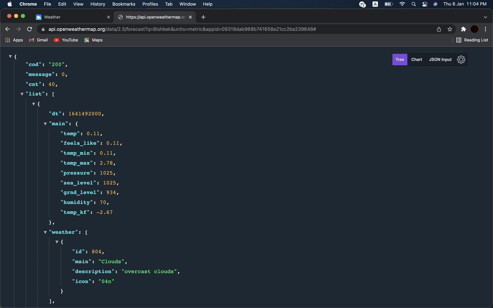
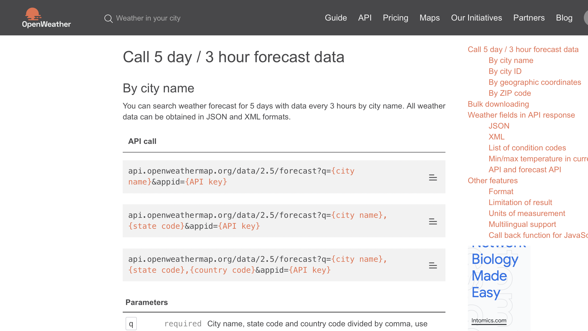

# Weather Website with API

In this Weather webapplication we used OpenWeatherAPI. You can search any city in the world and it will show you weather condition there.

You can see weather for today and another five days

# Openweather API

JSON

Documentation

# Feedbacks
https://drive.google.com/file/d/1nE2lcu0pnyRGzpfwtoP9CPdrvCIgm8F6/view?usp=sharing
______________________________________
It is a great application. I tried to search weather condition in my hometown in it showed everything I needed. Not only that it also shows weather condition five days ahead. It is a great website!

--------------------------------------
I have seen a lot of projects like this one, but I wont to say that this one has a little bit advantages from others, because it shows not only the temperature ,it also shows the wind speed, longitude-latitude and humidity.This characteristics are really important for the making plan.I really appreciate this one! Great job.

--------------------------------------
I was surprised how smooth it was. I just just typed any city and it showed all information about weather in no time. Also when I made mistake in a city name it showed a pop up that that said “There is no such city” I thought there will be no answer.

# Youtube presentation link:
https://youtu.be/9zGuzYKIxBA

# Team Members List
<h3>Bekmurzaev Elmir</h3>
<h3>Kudaiberdiev Eldiiar</h3>
